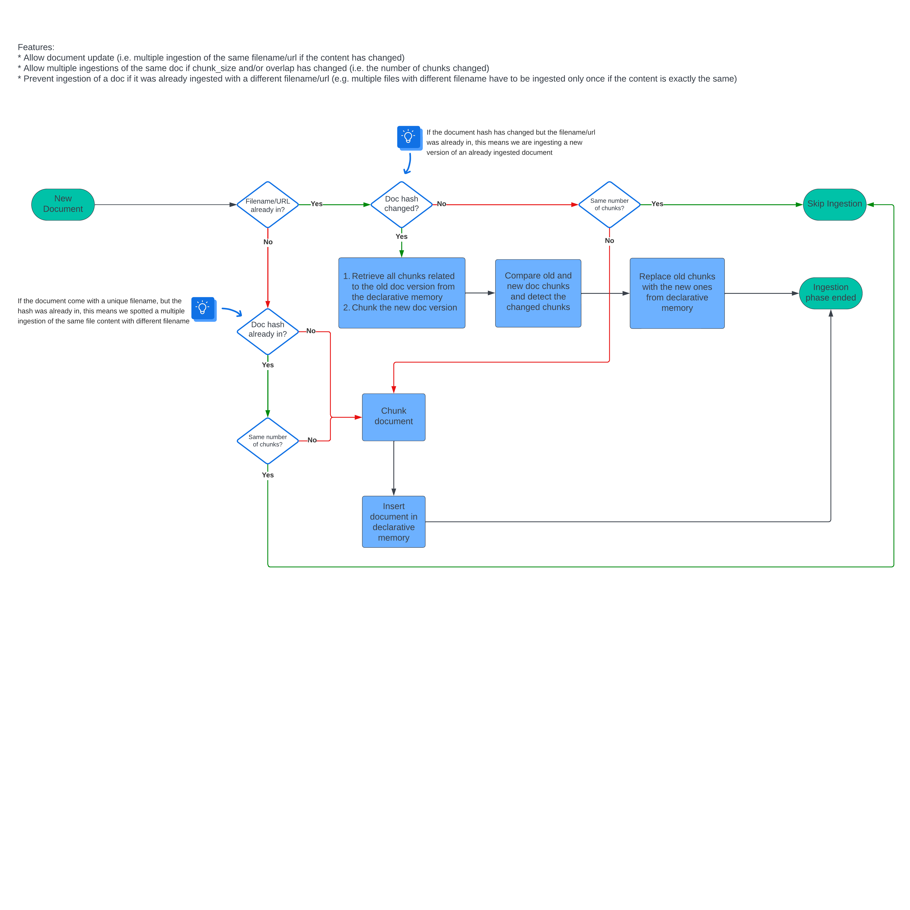

# Dietician

  

This plugin hooks into the `RabbitHole` to prevend multiple ingestions of the same document.

Using this plugin you can relax yourself and put into the RabbitHole all the files you want, the Dietician will only allow new documents (o newer versions of the same file, by updating only the modified chunks) for you.

If you like this plugin, please show appreciacion by giving a star to the repository, otherwise a kitten will die!

## Usage

1. Install the plugin
2. Enjoy

## Under the hood

